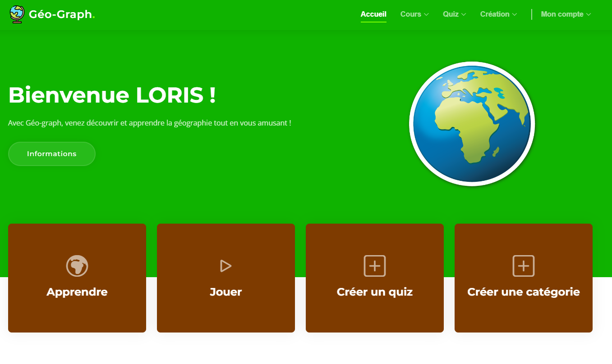
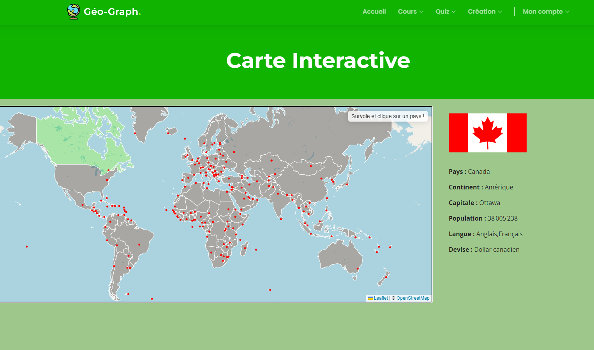
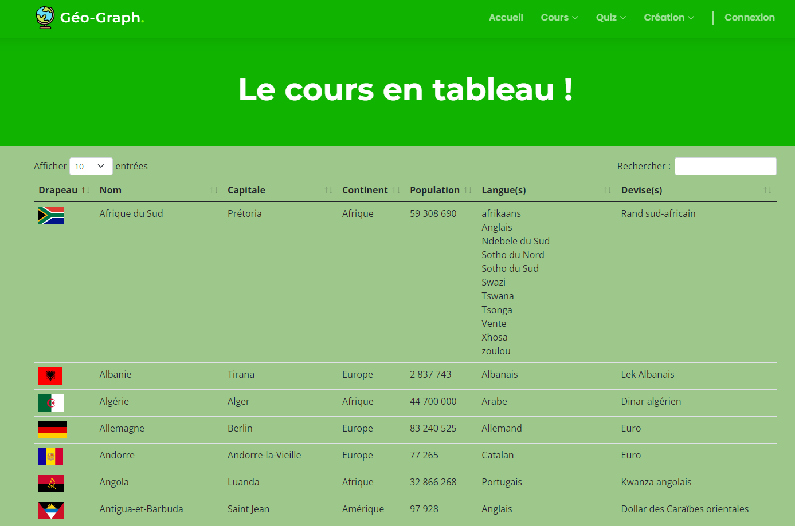
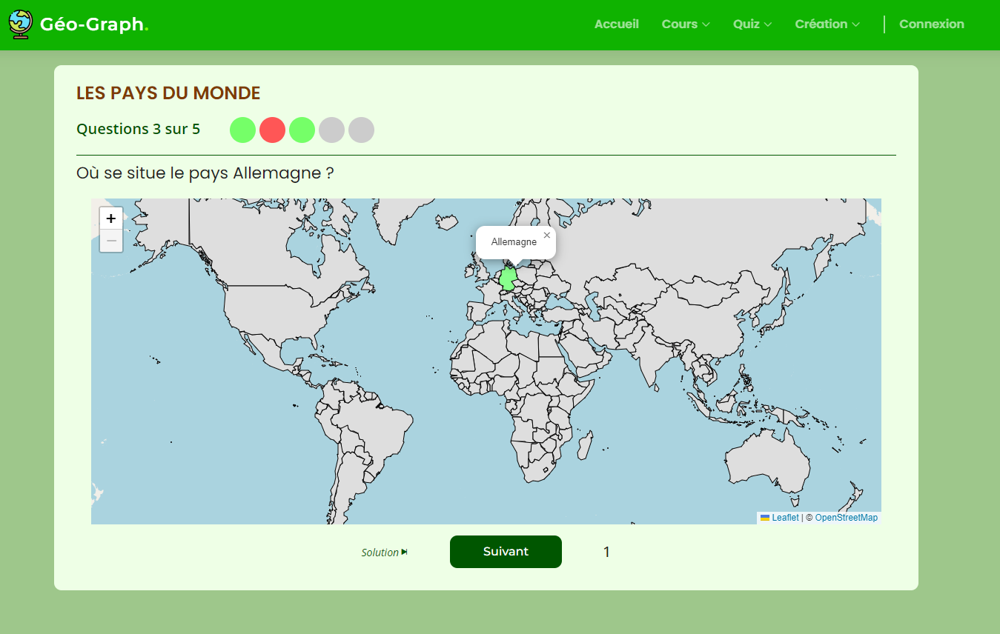
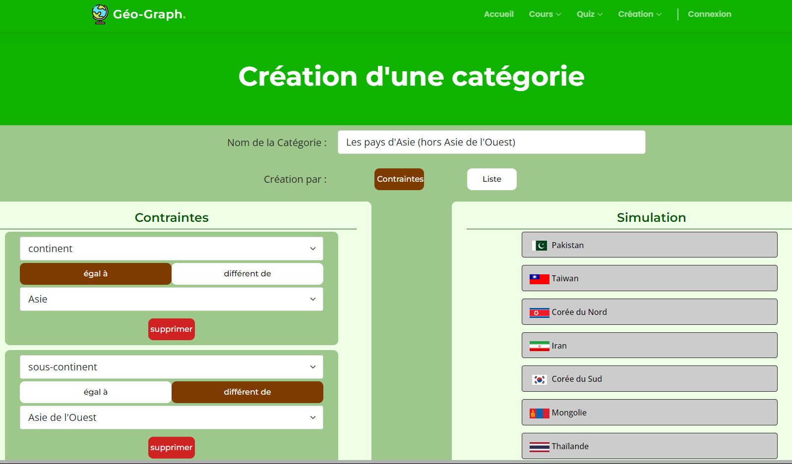

# Geo-Graph -- Logiciel Educatif
## Introduction
Vous voulez apprendre les capitales d’Europe ? Les drapeaux du G20 ? La langue officielle de tous les pays commençant par la lettre L ?
Avec GEO-Graph, créez vos propres quiz et défiez vos amis.
Profitez également de notre carte interactive pour réviser et en apprendre plus sur la géographie qui VOUS intéresse.
Visualisez votre progression et boostez vos points faibles.

Le site : [Geo-Graph](https://geograph.raex.go.yo.fr/)

### Caractéristiques
Langage Site : PHP/JS/HTML/CSS  
Script données : Python  
Année : 2023

## Table des matières
1. [Arborescence du projet](#1---arborescence-du-projet)
2. [Fonctionnalités](#2---fonctionnalités)
    - [Apprendre](#21---apprendre)
        1. [Carte interactive](#211---carte-interactive)
        2. [Les tableaux](#212---les-tableaux)
    - [Quiz](#22---quiz)
        1. [Les QCM](#221---les-qcm)
        2. [Les cartes](#222---les-cartes)
    - [Créer un quiz](#23---créer-un-quiz)
    - [Créer une catégorie](#24---créer-une-catégorie)

## 1-- Arborescence du projet

- **/assets**
    - **/css**     : Fichiers CSS.
    - **/img**     : Images et icones.
    - **/js**      : Fichiers JS permettant notamment la gestion des quiz.  
- **/database**
    - **/quiz**  : Fichiers JSON contenant les quiz générés.
    - **/templates**  : Fichiers JSON correspondant à une catégorie de quiz. Ces fichiers templates sont utilisés pour générer automatiquement les quiz liés à la catégorie.
    - **/world**  : Fichiers JSON contenant les informations sur les pays du monde.
    ________________________________________________________________________________________________________________________
    - **/categories.json** : Fichier JSON contenant les catégories de quiz disponibles ainsi que leur paramètre métier.
    - **/country-capitals.json** : Fichier JSON source contenant les capitales des pays du monde. Ce fichier est fusionné avec countriesAPI.json pour obtenir une base complète.
    - **/users.json** : Fichier JSON contenant les utilisateurs de l'application.
    - **/world2.js|json** : Fichier js/json contenant les informations géographiques des pays.
    - **/worldWithCapital.js|json** : Fichier js/json contenant les informations géographiques des pays + les capitales.
- **/log** : Fichier de log de l'application.
- **/php**
    - **/include** : Fichiers php contenant les blocs de code réutilisables. (header, footer, etc.)
    - **/libs** : Fichiers php contenant les fonctions réutilisables. (connexion utilisateur, fonction de log, etc.)
        - **/dataMetier** : Fichiers php contenant les fonctions réutilisables liées au métier. (génération de quiz, fénération de template, création de catégorie, etc.)
    - **/pages** : Fichiers php contenant les pages de l'application.
        - **/admin** : Fichiers php contenant les pages d'administration de l'application.
        - **/auth** : Fichiers php contenant les pages d'authentification de l'application.
        - **/server** : Fichiers php contenant les pages de traitement de l'application.  
- **index.php** : Page d'accueil de l'application.
- **README.md** : Fichier README du projet.
- **.gitignore** : Fichier de configuration de git.
- **scriptCapital.py**: Script python permettant le traitement et la génération du fichier worldWithCapital.json à partir de world2.json et country-capitals.json.
- **scriptCountries.py**: Script python permettant le traitement et la génération du fichier countriesAPI.json à partir de l'API REST countries.

## 2-- Fonctionnalités
### 2.1-- Apprendre
#### 2.1.1-- Carte interactive
La carte interactive permet de visualiser les pays du monde et d'obtenir des informations sur ces derniers. Survolez les pays avec votre souris et découvrez la géographie du monde.  

#### 2.1.2-- Les tableaux
Pour les révisions plus classiques, notre site contient une page regroupant les informations sur les pays du monde. Vous pouvez trier les pays par nom, capitale, langue, etc.

### 2.2-- Quiz
Tous les quiz sont générés automatiquement et aléatoirement à partir de templates. De ce fait, chaque partie est unique et vous permet d'engranger de la connaissance tout en vous amusant.

#### 2.2.1-- Les QCM
Une large partie de nos quiz est proposée sous forme de questions à choix multiple. Le nombre de propositions varie en fonction de la difficulté déterminée lors de la phase de création.

#### 2.2.2-- Les cartes
Pour les plus expérimentés, nous proposons également des quiz sous forme de carte. Vous devez alors placer les pays ou les villes directement sur la carte du monde. 

### 2.3-- Créer un quiz
Vous pouvez créer vos propres quiz et les partager avec vos amis. Pour cela, il vous suffit de choisir :
- Un nom de quiz
- Une catégorie (Monde, Europe, G20, etc...)
- Un type (QCM ou carte)
- Un nombre de questions
- Un nombre de propositions (uniquement pour les QCM)
- L'attribut sur lequel porte la question et l'attribut sur lequel porte la réponse.  
_Exemple :_ "nom" pour la question et "capitale" pour la réponse générera des questions du type "Quelle est la capitale de la France ?".

Comme vous le constater, la création de quiz est très simple et intuitive. Nous vous demandons uniquement de préciser les règles globales de votre questionnaire et nous nous chargeons de générer automatiquement les questions de façon aléatoire et non déterministe afin de rendre chaque partie unique !

### 2.4-- Créer une catégorie
Au-delà de l'aspect quiz, vous êtes également libre de créer vos propres catégories. Préciser simplement un nom et tester notre **moteur de contrainte** vous permettant de générer une liste de pays répondant à vos critères.

Pour plus de liberté, vous pouvez également selectionner un par un les pays composant votre catégorie de rêve.

